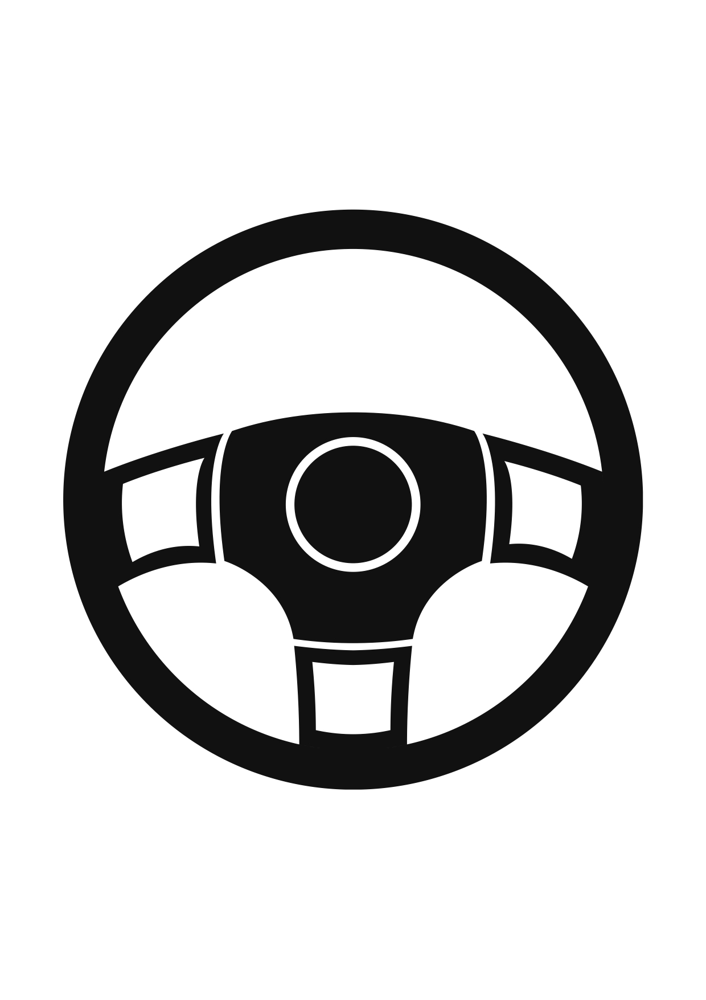
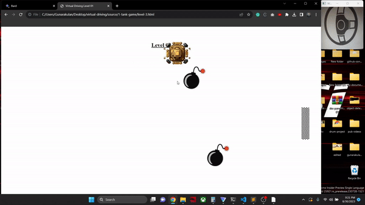
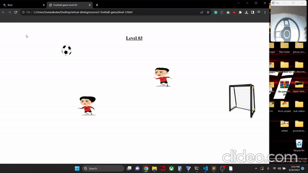
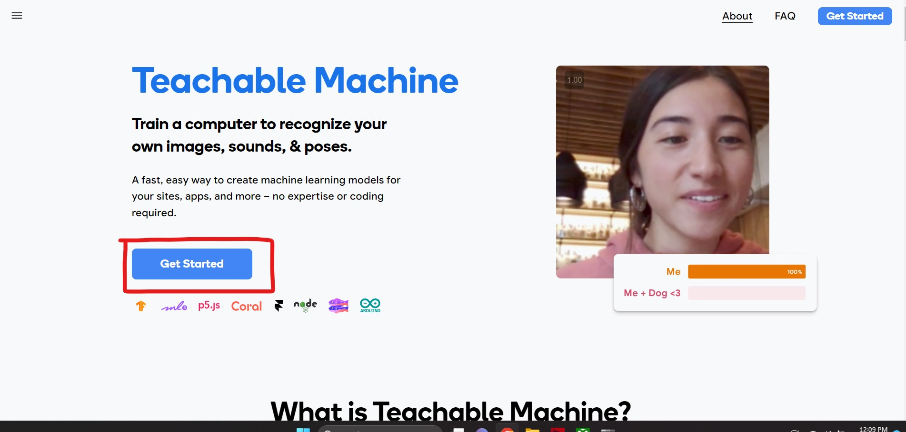
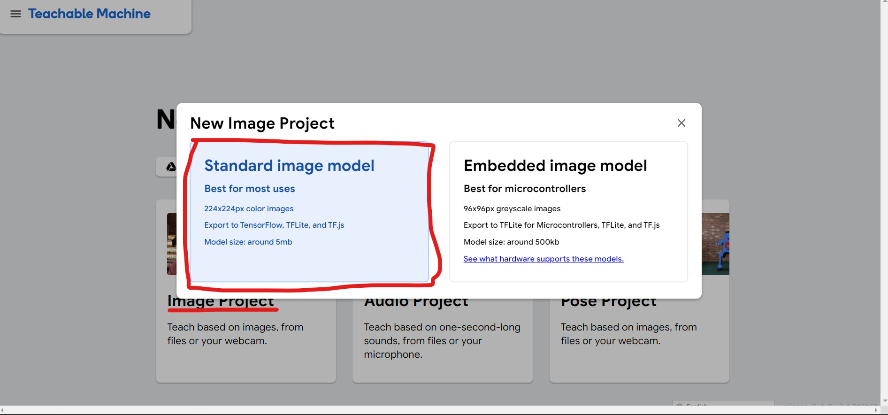
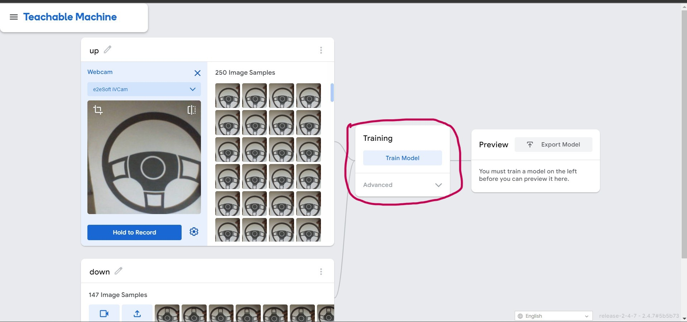

# Virtual Driving

## Repo Structure

```
    ├── docs                  # Contains project-related documents.
    ├── research              # Contains pre-research experiments.
    │   ├── 0-pre-prototype       # Contains pre-prototype (basic project).
    │   ├── 1-model.zip           # Contains trained model.
    ├── source                # Contains main source code.
    │   ├── 0-vr-driver           # Contains virtual driving app.
    │   ├── 1-tank-game           # Contains a web-based tank driving game.
    │   ├── 2-football-game       # Contains a web-based football game.
    ├── LICENSE               # Contains Licence
    └── README.MD             # Contains GitHub Readme Content.


```

## Introduction

The Virtual Driving Prototype is an innovative project that bridges the physical and virtual worlds using computer vision technology; a sheet of paper can be transformed into a joystick to control the game through a webcam, which helps to enhance the gaming experience, allowing players to control in-game vehicles with surprising precision.

The paper steering wheel becomes a tangible interface through the magic of computer vision and a standard webcam, bridging the gap between the player's physical actions and the virtual world on their screen.

It serves as a captivating example of how innovation can reshape the way we interact with and enjoy video games, offering a glimpse into the future of gaming experiences that are both entertaining and innovative.

**Note:** This AI model was trained with TechableMachine, a No-Code AI platform used for educational purposes. However, it is not suitable for production or enterprise purposes due to its lower performance quality.

## Technology Stack

- Python
- HTML
- CSS
- JavaScript
- TensorFlow
- Keras
- OpenCV
- Numpy
- Keyboard

## Setup

This repo's source folder has three sub-projects: Virtual Driving, Tank Game, and Football Game.

**Virtual Driving:** The Python prototype detects the car steering angles in the paper sheet through the webcam and triggers the arrow keys accordingly.

**Tank Game:** A simple web-based game written in HTML, CSS, and JavaScript to test the virtual driving prototype; the game's concept is to reach the end line without touching bombs (enemies). This game only uses arrow key inputs to negative.

**Football Game:** A simple web-based game written in HTML, CSS, and JavaScript to test the virtual driving prototype; the game's concept is to move the ball to the goalpost without touching opposing players.

**Note:** The Virtual Driving Prototype triggers the arrow keys (Up, Down, Left, Right) according to the webcam inputs; this prototype can be used for any purpose that needs to trigger arrow keys; it could also be applied to different games.

### Setup Tank Game and Football Game

**Note:** To set up the Tank Game and Football Game, there is no need for any installation. These games can be readily accessed within a web browser without requiring a web server by simply clicking the "level-1.html" file.

### Setup Virtual Driving Prototype

**Note:** To set it up, installing Python along with the requisite libraries is necessary. After successfully installing Python, the following steps should be followed to install the required libraries.

```
pip install tensorflow
```

```
pip install keras
```

```
pip install opencv-python
```

```
pip install keyboard
```

### Car Steering Input Image (Joystick)



**Note:** This image of a car steering wheel can be rotated to activate arrow keys.

## Execution

**Note:** To run the project, visit the following directory: "virtual-driving\source\0-vr-driver" and run the below command

- Step 01: Navigate to the following directory
    ```
        virtual-driving\source\0-vr-driver
    ```

- Step 02: Run the app
    ```
        python main.py
    ```

- Step 03: Please open a game that can be played using arrow keys.
    ```
        Game Folder: virtual-driving/source
            - Game 1: 1-tank-game
            - Game 2: 2-football-game
    ```

**Note:** You can play any game that requires arrow keys. Two games are included in the source folder.

## Demonstration

### Tank Game using Virtual Driving



### Football Game using Virtual Driving



## Train AI models with the Teachable Machine.

Teachable Machine is a Low-Code-AI tool that helps to train simple AI models to recognize images, sounds, & poses without coding experience. This tool is a gateway for beginners and enthusiasts, allowing them to train simple machine-learning models without extensive programming knowledge.

**Note:** Teachable Machine is not a good tool for developing enterprise applications; it can be used only for simple models and education purposes.

**Step 01:** Go to (https://teachablemachine.withgoogle.com)

**Step 02:** Click “Get Started Button”:



**Step 03:** Select “Image Project” and choose “Standard Image Model”:



**Step 04:** Collect Dataset

**Step 05:** Start Training



**Note:** After that, other steps are self-explanatory: create classes according to your needs; then add data to the relevant classes and click train to start the training process. Apart from this, advanced settings can be changed to improve performance and accuracy. The model can be uploaded online or downloaded locally; it also provides basic code to infer the model in Python, a Web App (TensorFlow | TensorFlowJS | TensorFlow Litte).

## Social Links

- [Linkedin Profile](https://www.linkedin.com/in/gunarakulangunaretnam)
- [Facebook Profile](https://www.facebook.com/gunarakulangunaratnam)
- [Instagram Profile](https://www.instagram.com/gunarakulangunaretnam)
- [Twitter Profile ](https://twitter.com/gunarakulangr)
- [Kaggle Profile](https://www.kaggle.com/gunarakulangr)
- [TikTok Profile](https://www.tiktok.com/@gunarakulangunaretnam)
- [Youtube Profile](https://www.youtube.com/channel/UCMWkED5sabgVZSCKjZuRJXA)
